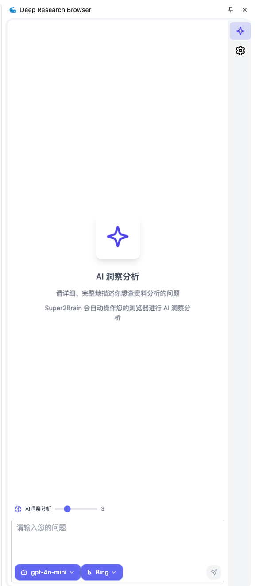

# Deep Research Browser

## 浏览器侧边栏助手 🖥️

通过我们的浏览器扩展，您可以在浏览网页的同时进行深度研究和搜索，无需切换标签页，提升您的工作效率！

## 快速开始 🚀

### 安装方法

**方法一：从源码安装**

```bash
# 安装依赖
pnpm install

# 编译项目
pnpm run prep
```

**方法二：从发布版本安装**

- 从 release 页面下载最新版本的扩展包

### 浏览器安装步骤

1. 打开浏览器的扩展管理页面

   - Edge: `edge://extensions`
   - Chrome: `chrome://extensions`

2. 开启"开发者模式"（通常在页面右上角）

3. 点击"加载已解压的扩展"，选择以下之一：
   - 编译后的 `out` 文件夹
   - 从 release 下载并解压的文件夹

> **注意**：首次安装后，需要刷新已打开的标签页或打开新标签页才能激活扩展功能。

## 核心功能 ✨

- **实时深度搜索**：在浏览网页的同时获取深度信息
- **无缝集成**：作为侧边栏工具，不干扰您的浏览体验
- **高度可定制**：支持多种搜索模式和结果展示方式

## 自定义模型支持 ⚙️

您可以根据个人需求：

- 选择不同的 AI 模型
- 配置各种 API 接口

通过这些定制选项，Deep Research Browser 能够提供最适合您工作流程的个性化搜索体验。

## 开发计划 📝

我们正在积极开发以下功能：

- **多种调研模式**：

  - 学术研究模式
  - 市场分析模式
  - 技术探索模式
  - 竞品对比模式

## 插件截图



## 贡献与反馈 💬

欢迎提交问题报告和功能建议，共同改进这个工具！
请联系


